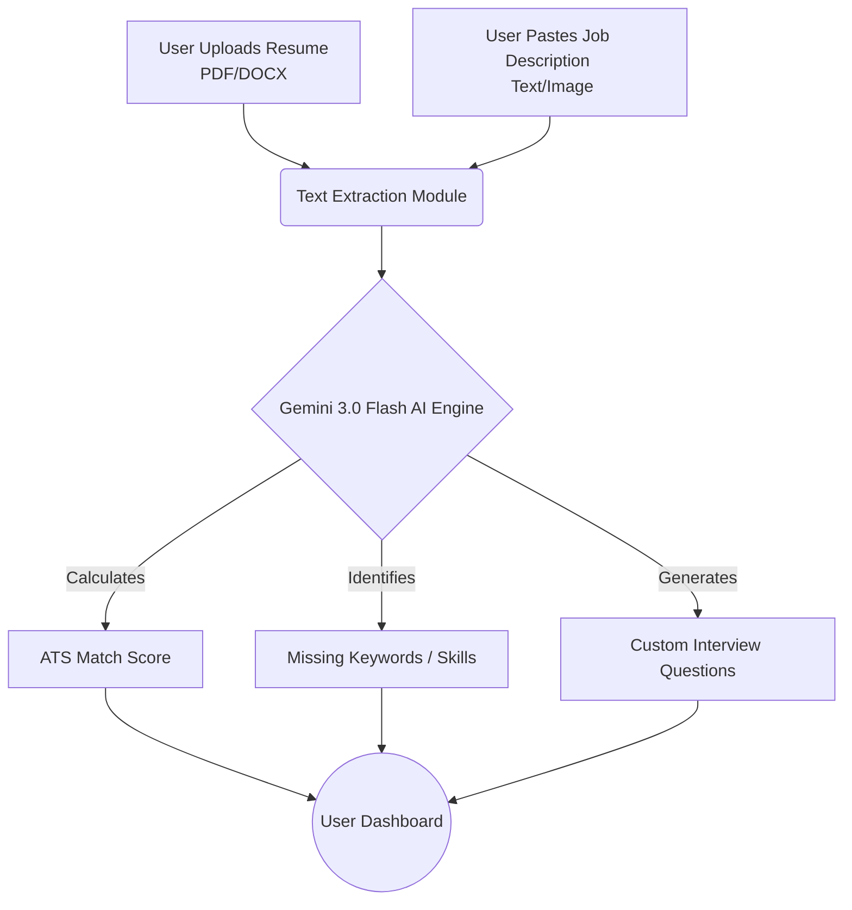

# careerzen 🧘‍♂️

> **AI-Powered Resume Optimization & Interview Prep**


**careerzen** is a next-generation career tool designed to help you land your dream job. It uses Google's powerful Gemini AI to analyze your resume against job descriptions, giving you a match score, ATS optimization tips, and even acts as an AI Interview Coach. This guide will walk you through everything you need to know about setting up, using, and contributing to careerzen!

---

## 🌟 Visual Workflow Guide

Getting started is as simple as uploading your resume and the job you want. Check out our simple illustrations to see how it works!

### 1. Resume Analysis Workflow
Our AI engine processes your resume and compares it against the job description to instantly give you a match score and actionable feedback.


### 2. AI Interview Coach
Once you're optimized, it's time to prep! Our interactive AI Coach helps you practice tailored interview questions based on your resume's weak spots.


---

## 🧩 How It Works (Architecture Flowchart)

Below is the technical flowchart illustrating the process of how careerzen extracts your data and generates insights:



---

## ✨ Core Features & Benefits

| Feature | What It Does | Why You Need It |
| :--- | :--- | :--- |
| **🎯 Instant Analysis** | Scores your resume against job descriptions | Saves time by telling you if a job is worth applying for |
| **🖼️ Multimodal Optimizer** | Upload PDF/Word or take screenshots of job postings | Flexibility to parse any job listing format automatically |
| **🤖 AI Interview Coach** | Creates custom mock interview scenarios | Prepares you for the specific questions recruiters will ask |
| **🕒 Precision History** | Saves your history with IST timestamps | Easily look back at past optimizations and track progress |

---

## 🛠 Tech Stack

| Layer | Technology |
| :--- | :--- |
| **Frontend Framework** | Next.js 16 (App Router) |
| **Styling & Animation** | Tailwind CSS v4, Framer Motion, GSAP |
| **Database & ORM** | PostgreSQL (Cloud), Prisma |
| **Authentication** | Clerk Auth |
| **AI Intelligence** | Google Gemini-3-Flash-Preview |
| **Document Parsing** | pdf2json, mammoth (for DOCX) |

---

## 🏁 Getting Started (Developer Guide)

Follow these simple steps from your terminal to get the platform running locally on your machine.

1. **Clone the repository**
   ```bash
   git clone https://github.com/aniruddhaadak80/smart-resume-analyzer.git
   cd smart-resume-analyzer
   ```

2. **Install all dependencies**
   ```bash
   npm install
   ```

3. **Set up Local Variables**
   Create a `.env.local` file in the root folder. You will need a Google Gemini API Key and your Clerk/Prisma variables.
   ```env
   GEMINI_API_KEY=your_google_api_key_here
   # Add your Clerk and DB credentials as well
   ```

4. **Initialize Database**
   ```bash
   npx prisma generate
   npx prisma db push
   ```

5. **Run the Development Server!**
   ```bash
   npm run dev
   ```
   *The app will be available at `http://localhost:3000`.*

---

## 🤝 Contributing

Contributions are always welcome! Please check out the Issues tab on GitHub for a list of features we are currently looking to add.

---

© 2026 careerzen. Built with ❤️ and AI.
